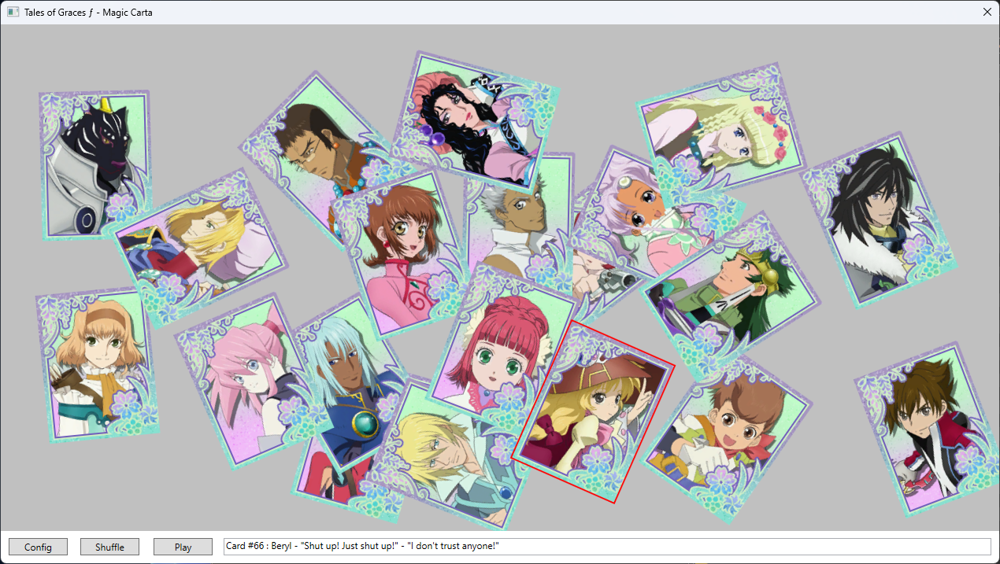
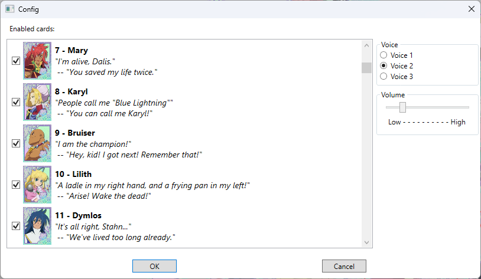

WPFCarta
--------

A small tool to help you practice the "Carta" mini-game in _Tales of Graces f_

The minigame is modeled after the Japanese "karuta" (カルタ) card game, which is traditionally played around New Year's Eve.

The goal of the game is to know the two parts of the poem (in the original game) or skit (in _Tales_), and, given the first part, to quickly find the correct card that contains the matching second part of the skit.

This tool helps you practice this, by giving you a set of random cards and letting you listen to the full skits by right-clicking any card. You can choose which cards are in the set and which aren't, and in which voice from the game you want to listen to the skits.

The main window
---------------

In this window you can shuffle and deal a set of random cards, drag them around, and listen to the corrsponding skits by right-clicking the cards.
Additionally, the status bar at the bottom shows the card number and the two lines of dialog as text.

The config window
-----------------

Here you can configure which cards you want to see, in which voice you want to hear the skits, and adjust the playback volume.

Todo
----

Things that are not (yet) implemented:
- actually _playing_ the game as opposed to practicing. This would include shuffling the cards, playing a random skit, and timing how long the player takes to click on the correct card.
- Changing the number of shuffled/dealed cards
- Allowing the user to rotate the cards
- bugfixing (e.g. cancelling audio when you exit the program while a skit is still playing)
